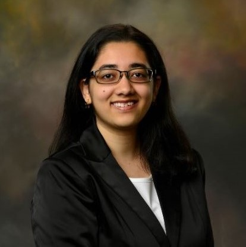
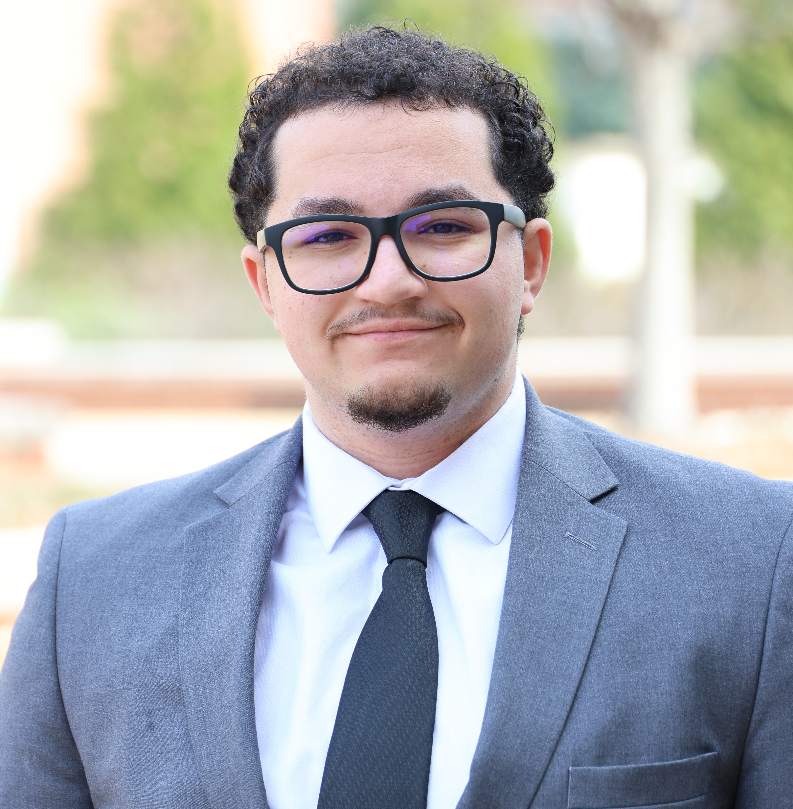

| [About](./index.html)      | [People](./people-page.html)         | [Research](./research-page.html) |[Publications](./publications_page.html)|

## Current Students

<html>
<head>
<meta name="viewport" content="width=device-width, initial-scale=1">

</head>
<body>

  

    

      
      

        <h2>Kanak Parmar</h2>
        
Graduate Student

        
Her research interests include astrodynamics and adaptive trajectory planning algorithms.

      

    

  

  

    

      
      

        <h2>Rehman Qureshi</h2>
        
Graduate Student

        
His research interests include constellation design and artificial intelligence. 

      

    

  

  

    

      
      

        <h2>Joseph Ivarson</h2>
        
Graduate Student

        
His research interests include the design, applications, and analysis of space technology, such as deployable structures and instrument concepts.

      

    

  

      

        
        

          <h2>Luke Scharck</h2>
          
Graduate Student

          
 His research interest includes astrodynamics with applications of trajectory control and design.

        

      

  
  

  

      

        
        

          <h2>Zachary Fizell</h2>
          
Graduate Student

          
 His research interests include attitude dynamics within cislunar environment and gravitational multi-body dynamics. 

        

      

  
  
  

      

        
        

          <h2>Ana Barona</h2>
          
Graduate Student

          
 His research interest includes orbit environment sustainability and orbit debris remediation.

        

      

  
  
  

 

  

      

        
        

          <h2>Ray Patrick</h2>
          
Graduate Student

          
 His research interests include performance modeling and vulnerability characterization for large satellite constellations. 

        

      

  
 
  

      

        
        

          <h2>Tithi Patel</h2>
          
Graduate Student

          
 Her research interests include trajectory design and satellite de-orbit planning, with a focus on the CORA satellite project. 

        

      

  
 

 

   
   

      

        
        

          <h2>Eirik Mulder</h2>
          
Undergraduate Student

          
 His research interests include user interaction design, immersive reality, astrodynamics, and machine learning. 

        

      

  
 
  

      

        
        

          <h2>Luis Postigo</h2>
          
Undergraduate Student

          
 His research interests include the design and analysis of space systems, with an emphasis on data analysis and machine learning techniques. 

        

      

  
 

  

      

        
        

          <h2>Laith Bader</h2>
          
Undergraduate Student

          
 His research interests include the effectiveness of spatial computing for astrodynamics in classrooms, as well as the design of space technology for space debris remediation. 

        

      

  
 
  

      

        
        

          <h2>Kody Willingham</h2>
          
Undergraduate Student

          
 His current research involves using immersive reality systems to visualize and design trajectories across multiple reference frame.

        

      

  
 
  

 
</body>
</html>

## Alumni and Visiting Scholars

[Francesco Viola (visiting scholar)](https://www.linkedin.com/in/francesco-viola-/)
[Manuel Indaco (Ph.D.)](https://www.linkedin.com/in/manuel-indaco-b51350198/)  
[Dhathri Somavarapu (Ph.D.)](https://www.linkedin.com/in/dhathrisomavarapu)  
[Deepika Singla (undergraduate)](https://www.linkedin.com/in/deepikagarg08/)  
Nathan Adkins (undergraduate)  
Will Taylor (undergraduate)  
[Andrea Brandonisio (visiting scholar)](https://www.linkedin.com/in/andreabrandonisio/)  
[Loïc Poncin (visiting scholar)](https://www.linkedin.com/in/loic-poncin/)  
[Aurélien Belmont (visiting scholar)](https://www.linkedin.com/in/aur%C3%A9lien-belmont-aa057a21a/)

