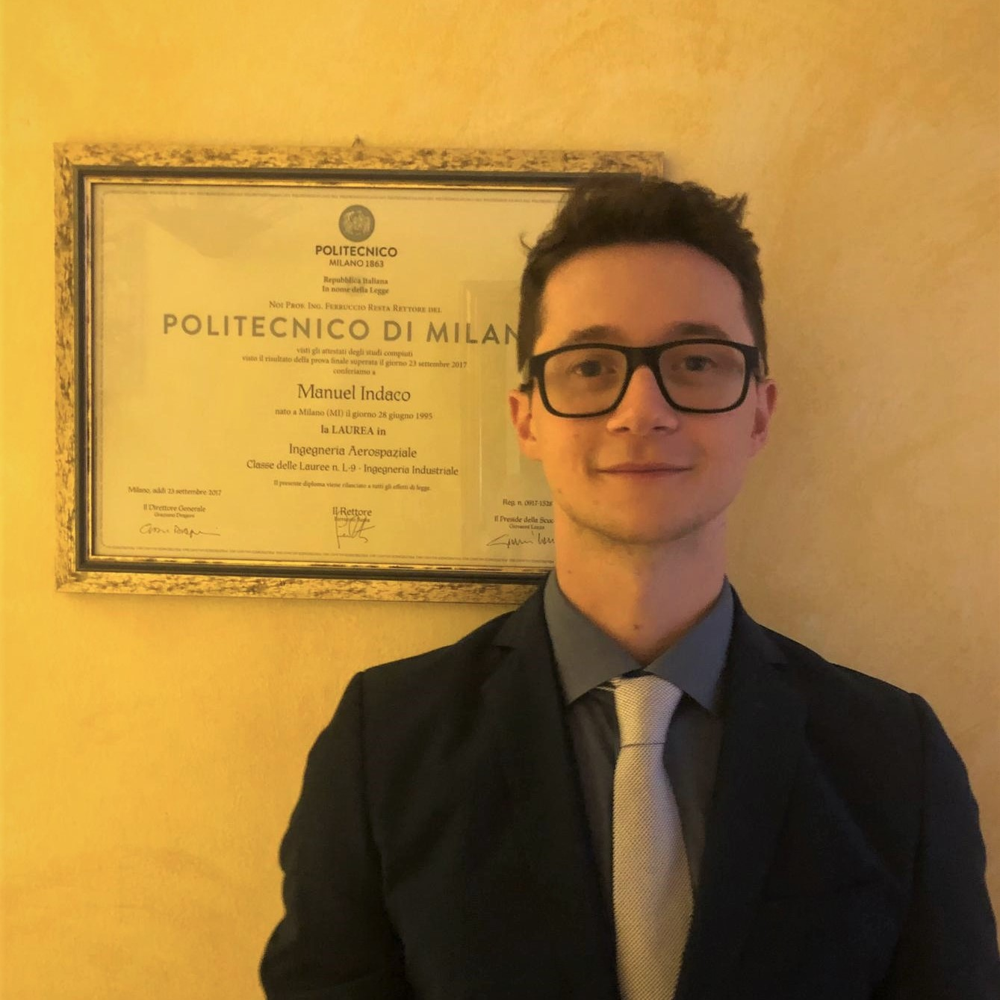

| [About](./index.html)      | [People](./people-page.html)         | [Research](./research-page.html) |[Publications](./publications_page.html)|

## Current Students

<html>
<head>
<meta name="viewport" content="width=device-width, initial-scale=1">

</head>
<body>
  

  

    

      
      

        <h2>Kanak Parmar</h2>
        
Graduate Student

        
Her research interests include astrodynamics and adaptive trajectory planning algorithms.

      

    

  

 

    

      
      

        <h2>Manuel Indaco</h2>
        
Graduate Student

        
His research interests include the exploitation of machine learning techniques for space applications.

      

    

  

  
    

    

      
      

        <h2>Rehman Qureshi</h2>
        
Graduate Student

        
His research interests include constellation design and artificial intelligence. 

      

    

  

  
  

    

      
      

        <h2>Joseph Ivarson</h2>
        
Graduate Student

        
His research interests include the design, applications, and analysis of space technology, such as deployable structures and instrument concepts.

      

    

  

  
  

      

        
        

          <h2>Luke Scharck</h2>
          
Graduate Student

          
 His research interest includes astrodynamics with applications of trajectory control and design.

        

      

  
  
  
  

      

        
        

          <h2>Eirik Mulder</h2>
          
Undergraduate Student

          
 His research interests include user interaction design, immersive reality, astrodynamics, and machine learning. 

        

      

  
  

 

  

      

        
        

          <h2>Laith Bader</h2>
          
Undergraduate Student

          
 --- 

        

      

  
  
  
  

      

        
        

          <h2>David Bevington </h2>
          
Undergraduate Student

          
 --- 

        

      

  
  

</body>
</html>

## Alumni and Visiting Scholars
<html>
  <body>
  [Dhathri Somavarapu (Ph.D)](https://www.linkedin.com/in/dhathrisomavarapu)  
  [Deepika Singla (undergraduate)](https://www.linkedin.com/in/deepikagarg08/)  
  Nathan Adkins (undergraduate)  
  Will Taylor (undergraduate)  
  [Andrea Brandonisio (visiting scholar)](https://www.linkedin.com/in/andreabrandonisio/)  
  [Loïc Poncin (visiting scholar)](https://www.linkedin.com/in/loic-poncin/)  
  [Aurélien Belmont (visiting scholar)](https://www.linkedin.com/in/aur%C3%A9lien-belmont-aa057a21a/)
  </body>
</html>

