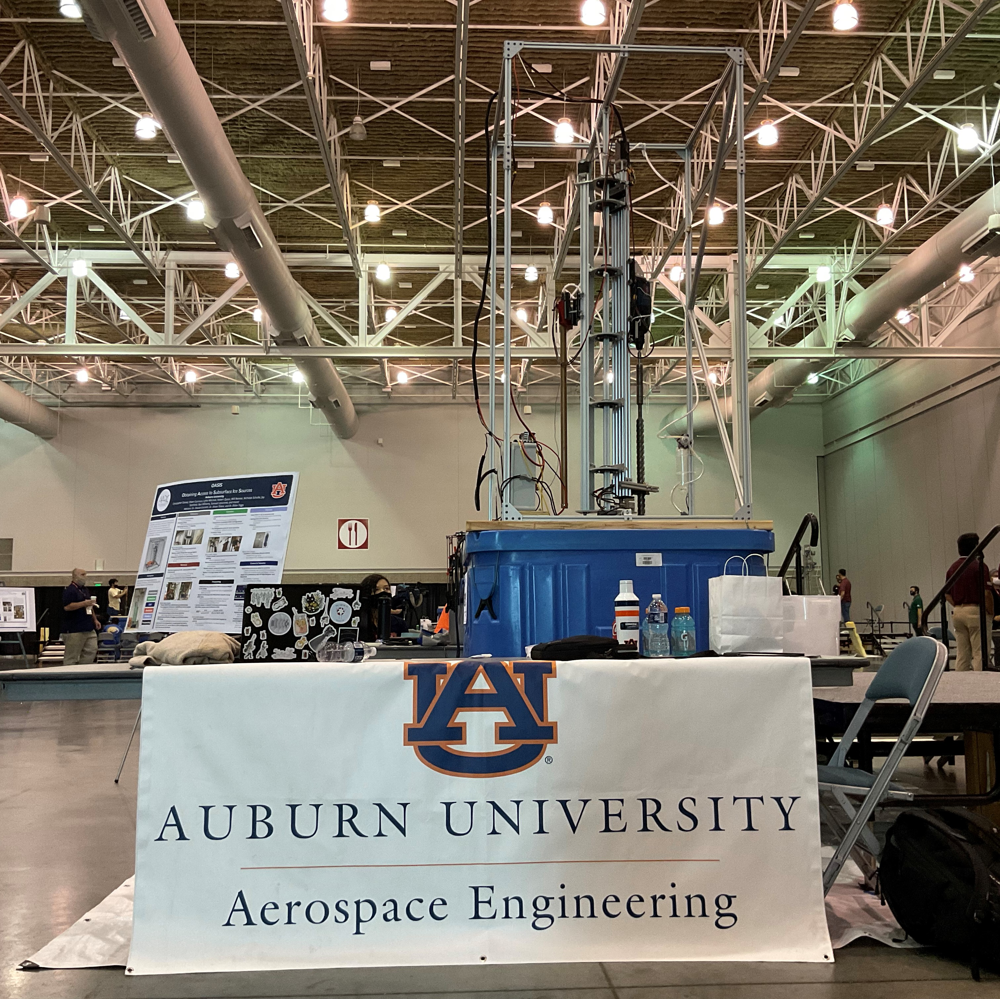

| [About](./index.html)      | [People](./people-page.html)         | [Research](./research-page.html) | [Publications](./publications_page.html)|

<html>
<head>
<meta name="viewport" content="width=device-width, initial-scale=1">

<!-- Add icon library -->
<link rel="stylesheet" href="https://cdnjs.cloudflare.com/ajax/libs/font-awesome/4.7.0/css/font-awesome.min.css">
  

</head>
<body>

<h2>Legend</h2>

<button class="btn"><i class="fa fa-television"></i> Poster</button>
<button class="btn"><i class="fa fa-file-pdf-o"></i> Article</button>
<button class="btn"><i class="fa fa-youtube-play"></i> Video</button>
<button class="btn"><i class="fa fa-mortar-board"></i> Edu Content</button>

 
   <button class="btn"><i class="fa fa-gamepad"></i> Interactive Content</button>

  <!--  
  

  

    

      
    

    

      
    

     

        <h2>Project Title</h2>
        
Collaborators

        
Description of the project

       
       
Icon buttons with text:

<button class="btn" onclick="window.location.href='https://w3docs.com';"><i class="fa fa-television"></i></button>
<a href="./assets/projects/multibody/artwork007.png" download> <button class="btn"><i class="fa fa-file-pdf-o"></i> 2021 </button> </a>
<button class="btn"><i class="fa fa-youtube-play"></i></button>
<button class="btn"><i class="fa fa-mortar-board"></i> Close</button>
  <button class="btn"><i class="fa fa-gamepad"></i> </button>

       
      

  

 
//-->
   

  

    

    

      
    

    

      
    

    

     

        <h2>6DOF Motion within Multi-Body Gravitational Fields</h2>    
       

         This research explores fundamental astrodynamics questions related to the orbit and attitude motion of rigid bodies within a multi-body gravitational field or for space systems operating under that regime.
       
 
       

<a href="https://engineering.purdue.edu/people/kathleen.howell.1/Publications/Conferences/2017_AAS_GuzZimHowDav.pdf" download> <button class="btn"><i class="fa fa-file-pdf-o"></i> 2017 </button> </a>
       <a href="https://link.springer.com/article/10.1007/s42064-017-0012-7"> <button class="btn"><i class="fa fa-file-pdf-o"></i> 2018 </button> </a>
       <a href="https://www.researchgate.net/profile/Davide-Guzzetti/publication/370897369_FEASIBILITY_STUDIES_FOR_AN_AUTONOMOUS_CISLUNAR_POSITION_NAVIGATION_AND_TIMING_CONSTELLATION/links/6467d5d770202663165b5929/FEASIBILITY-STUDIES-FOR-AN-AUTONOMOUS-CISLUNAR-POSITION-NAVIGATION-AND-TIMING-CONSTELLATION.pdf?origin=searchReact&_iepl%5BgeneralViewId%5D=f5XzTY6MQe9uEIJ2p6mtzNaLTjBfEQfoVmQ7&_iepl%5Bcontexts%5D%5B0%5D=searchReact&_iepl%5BviewId%5D=JGMJIw4DiowTk91gF5YHph9I2vvXxSjubKHn&_iepl%5BsearchType%5D=publication&_iepl%5Bdata%5D%5BcountLessEqual20%5D=1&_iepl%5Bdata%5D%5BinteractedWithPosition1%5D=1&_iepl%5Bdata%5D%5BwithoutEnrichment%5D=1&_iepl%5Bposition%5D=1&_iepl%5BrgKey%5D=PB%3A370897369&_iepl%5BinteractionType%5D=publicationDownload"> <button class="btn"><i class="fa fa-file-pdf-o"></i> 2022 </button> </a>
       <a href="https://arc.aiaa.org/doi/abs/10.2514/6.2024-1452"> <button class="btn"><i class="fa fa-file-pdf-o"></i> 2024 </button> </a>
       

            

<a href="https://auburncatalog.instructure.com/enroll/GYJ6JC" > <button class="btn"><i class="fa fa-mortar-board"></i> Intro to Multi-Body Dynamics</button> </a>
<a href="https://respected-deeply-allspice.glitch.me/" > <button class="btn"><i class="fa fa-gamepad"></i> Halo Orbit VR </button> </a>

       
      

  

 
 

        

 

  

    

    

      
    

    

      
    

    

     

       
        <h2>Flat Fabrication of Self-Assembling Space Systems</h2>
        
Collaborators: Russell Mailen

       
       

<a href="./assets/projects/flatfab/poster2023.pdf" download> <button class="btn"><i class="fa fa-television"></i> 2023 </button> </a>
<a href="https://doi.org/10.1117/1.JATIS.10.2.024002"> <button class="btn"><i class="fa fa-file-pdf-o"></i> 2024 </button> </a>
       <a href="https://doi.org/10.1016/j.apmt.2023.101949"> <button class="btn"><i class="fa fa-file-pdf-o"></i> 2023 </button> </a>
       <a href="./assets/projects/flatfab/long2021.pdf"> <button class="btn"><i class="fa fa-file-pdf-o"></i> 2021 </button> </a>
       <a href="https://youtu.be/SA0EGtNQh-s"> <button class="btn"><i class="fa fa-youtube-play"></i> The Idea </button> </a> 

           

  

  

      
  

  

    

    

      
    

    

      
    

    

     

        <h2>Resilience of Proliferated LEO Constellations</h2>
        
Collaborators: Daniel Tauritz

       

          <a href="./assets/projects/pleo/ATLAS_N_paper.pdf"> <button class="btn"><i class="fa fa-file-pdf-o"></i> 2021 </button> </a>
       

      

  

  

  
  
  

  

    

      
    

     

        <h2>Immersive Trajectory Design and Mission Analysis</h2>
       

          <a href="./assets/projects/vr/guzzetti2020.pdf"> <button class="btn"><i class="fa fa-file-pdf-o"></i> 2020 </button> </a>
         <a href="https://ui.adsabs.harvard.edu/link_gateway/2021AcAau.184..208S/doi:10.1016/j.actaastro.2021.04.004"> <button class="btn"><i class="fa fa-file-pdf-o"></i> 2021 </button> </a>
         <a href="./assets/projects/vr/somavarapu2021.pdf"> <button class="btn"><i class="fa fa-file-pdf-o"></i> 2021 </button> </a>
       

      

  

  

  
  
  

  

    

    

      
    

    

      
    

    

     

        <h2>Human-Machine Teaming for Space System Autonomy and Management</h2>
       

   <a href="https://ieeexplore.ieee.org/abstract/document/8651466"> <button class="btn"><i class="fa fa-file-pdf-o"></i> 2019 </button> </a>      
<a href="https://ui.adsabs.harvard.edu/link_gateway/2021AdSpR..68.1928P/doi:10.1016/j.asr.2021.04.023"> <button class="btn"><i class="fa fa-file-pdf-o"></i> 2021 </button> </a>
       
  
      

  
  

  

  
  
  
  

  

    

    

      
    

    

      
    

    

     

        <h2>Student Competitions</h2>
        
Collaborators: Ehsan Taheri

       

<a href="https://www.youtube.com/watch?v=xaCj19op5y8"> <button class="btn"><i class="fa fa-youtube-play"></i> The Idea </button> </a>
         <a href="https://www.youtube.com/watch?v=b7qNSaM_k6s&t=90s"> <button class="btn"><i class="fa fa-youtube-play"></i> The Final</button> </a> 
        

      

  

  

       
</body>
</html>
